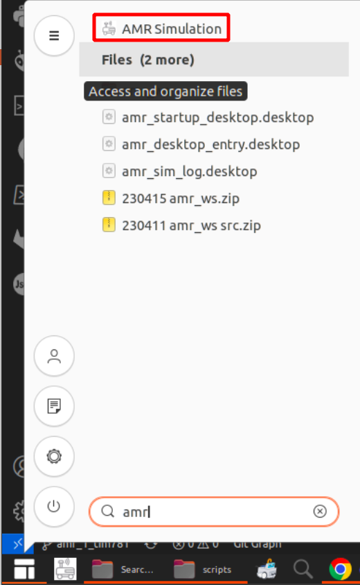
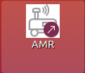
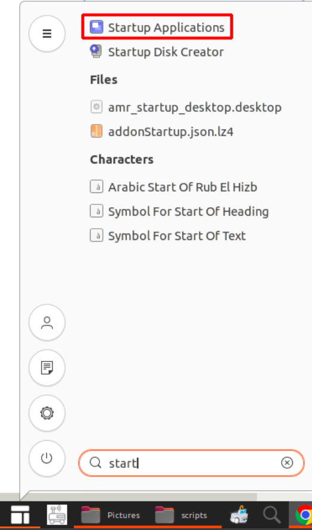
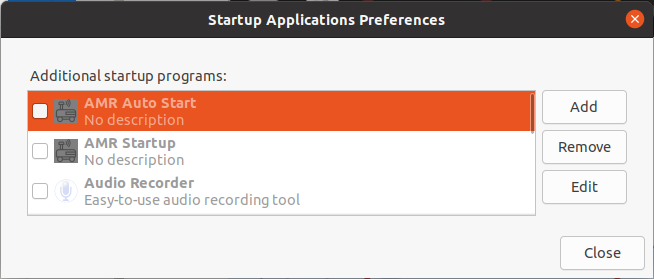

# Create ROS entry point

Owner: Tran Duc HAI
Notion: [Notion link](https://www.notion.so/Create-ROS-entry-point-47867e676aa94451bd798e34925f801b?pvs=4)

<span style="color:red"> Note: Tài liệu trong file này có thể không phải mới nhất, xem link Notion để có tài liệu mới nhất</span>

# Giới thiệu

Tất cả các ứng dụng ROS, Robot đều dùng package này để tạo các file khởi động từ desktop, auto start, khởi động simulation

Tải pkg tại: ‣

Cấu trúc thư mục:

```bash
├── cfg
│   ├── robot_define.yaml # File define Robot: name, server address
│   └── ros_config.sh # File cấu hình ROS, workspace, file launch khởi động
├── CMakeLists.txt
├── package.xml
└── scripts
    ├── amr_auto_start.desktop # File auto start, tìm ứng dụng này ở App drawer/Startup Applications
    ├── amr_desktop_entry.desktop # File khởi động, tìm ứng dụng này ở Desktop
    ├── amr_simulation.desktop # File khởi động vào chế độ simulation, tìm ứng dụng này trong App drawer
    ├── amr_startup.sh # File khởi động (bao gồm cả chế độ simulation)
    ├── create_entry_point.sh # Chạy file này để tự động tạo các file khởi động
    └── env.sh # Tạo các biến môi trường cần thiết
```

# Cách sử dụng

1. Chạy file `create_entry_point.sh`
2. Vào `$HOME/robot_config` sửa các file

   1. robot_config.sh

      ```bash
      # Địa chỉ ROS dùng để remote qua App config Robot (tablet)
      ros_master=localhost
      # Workspace chứa source
      export ROS_WORKSPACE=$HOME/amr_ws
      # File launch khởi động Robot với phần cứng thật
      export ROS_ENTRY_REAL="roslaunch agvlidar_common agvlidar_common.launch simulation:=false use_rviz:=false use_joystick:=true"
      # File launch khởi động Robot ở chế độ Simulation
      export ROS_ENTRY_SIMULATION="roslaunch agvlidar_common agvlidar_common.launch simulation:=true use_rviz:=true use_joystick:=false"
      export ROS_MASTER_URI=http://$ros_master:11311
      export ROS_HOSTNAME=$ros_master
      ```

   2. robot_define.yaml

      ```bash
      # Địa chỉ hệ thống AGV Control System
      server_address: "http://192.168.XXX.XXX:1337/parse/"
      # Định danh AGV trên AGV Control System
      agv_name: "AGV XX"
      ```

3. Chạy

   1. Simulation

      Nhấn `Window` để vào `App Drawer`, click vào icon `AMR Simulation`

      

   2. Khởi động phần mềm cho Robot thật

      Trên Desktop, click chuột vào icon `AMR`

      

   3. Auto start, vào `App Drawer/Startup Applications` để kiểm tra

      

      Có thể tắt đi:

      
